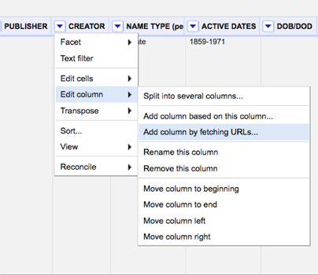
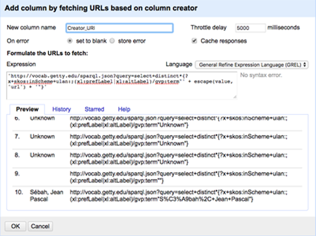
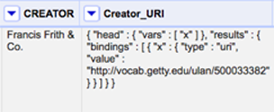
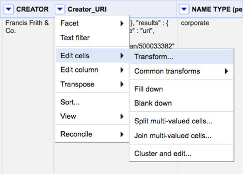
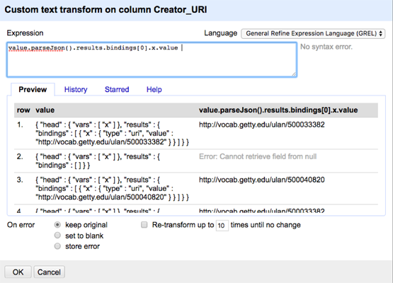
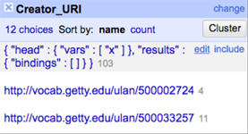

# Reconcilation with the Getty Vocabularies

Brief instructions can be found here: http://vocab.getty.edu/queries#OpenRefine_Reconciliation_Service

Gregg Garcia (Getty) has also created a [useful presentation](https://www.getty.edu/research/tools/vocabularies/garcia_open_refine.pdf)

**Note:** Before beginning reconciliation, make sure you have stripped all whitespace as this system only does exact matches (**Edit cells > Common transformations > Trim leading and trailing whitespace**)

1. Unlike other reconciliation tools that use OpenRefine’s “reconcile” feature, for the Getty vocabularies you start the reconciliation process by going to **Edit column > Add column by fetching URLs…**
  


2. In the new window that opens, you need to enter a name for the column (“Creator_URI” in the example) and an expression to fetch the URLs. If you are reconciling names with the Union List of Artist Names (ULAN), you can copy and paste the expression below:

```'http://vocab.getty.edu/sparql.json?query=select+distinct*{?x+skos:inScheme+ulan:;(xl:prefLabel|xl:altLabel)/gvp:term"' + escape(value, 'url') + '"}'```



After entering this information, press “OK.” 

**Note:** This expression can be modified to fetch from the rest of the Getty’s vocabularies. Change the string following “inScheme+” to get URIs from other sources (aat, tgn). Most ULAN records do not have a language attribute, but a language can also be specified if using the AAT or another vocabulary. If you are looking for Dutch terms in the AAT, you can use the following expression:

```'http://vocab.getty.edu/sparql.json?query=select+distinct*{?x+skos:inScheme+aat:;(xl:prefLabel|xl:altLabel)/gvp:term"' + escape(value, 'url') + '"@nl}'```

 If your data is in a language other than Dutch, you can also change the code following the @ symbol near the very end of the expression (for instance @en for English). The language labels come from the IANA subtag registry - https://www.iana.org/assignments/language-subtag-registry/language-subtag-registry More on this can be found in a presentation by Vladimir Alexiev. Some language tags from IANA were altered by the Getty to be more specific. 

Once complete, you will need to wait a short time until the column is created.


Once finished processing, you’ll see JSON (think curly brackets) in each of the cells for the new column.



3. Next, the URI associated with value needs to be parsed out from the rest of the characters in the Creator_URI value. To do this click on the downward pointing arrow on the top of the Creator_URI column and go to **Edit cells > Transform**.



Enter value.parseJson().results.bindings[0].x.value into the expression box. Press “OK.” This will result in the URI value being outputted by itself if a match was found. Note that this only works for exact matches.



Once back in the main spreadsheet, text facet on the Creator_URI column and clean out all the cells that have {"head" : {"vars" : [ "x" ],"results" : {"bindings" : [ ]}} as a value by clicking on edit and deleting this string.



### Fuzzy Matching

The instructions above only work if authority work has already been done and the metadata contains an exact match. “Fuzzy” matching, or identifying authorities that are similar to the name entered, can also be achieved using Lucene.

'http://vocab.getty.edu/sparql.json?query=select+distinct*{?x+skos:inScheme+ulan:;luc:term+"' + escape(value, 'url') + '"}'

(forEach(value.parseJson().results.bindings, v, v.x.value).join(" | "))
