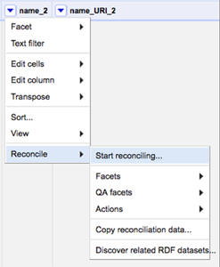
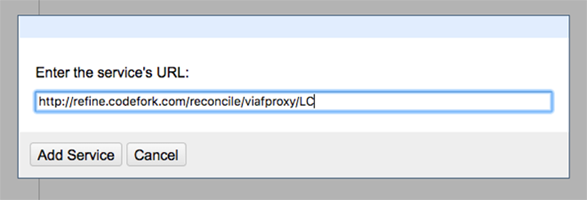
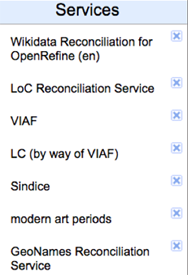
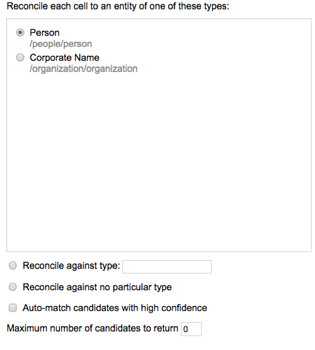
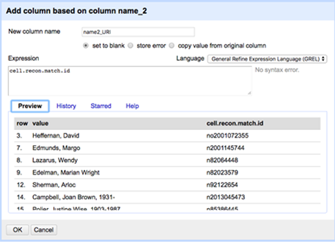
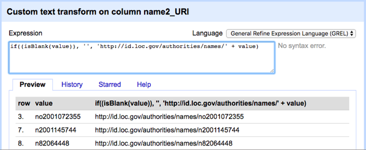

# Reconcilation with the Virtual International Authority File (VIAF)

Provided by http://refine.codefork.com/ OR https://github.com/codeforkjeff/conciliator

Use only for matching with Library of Congress Name Authorities

### Installation Instructions  

1. Add reconciliation service by going to a column and clicking on “Start reconciling” under “Reconcile”
 


2. Next click on “Add Standard Service” in the bottom-left-hand corner.


3. Then enter the following URL http://refine.codefork.com/reconcile/viafproxy/LC in the pop up.



4. After this is complete, you should see “LC (by way of VIAF)” appear in your “Services” list. You only need to add the service once.



### Reconciling
Follow step one above and select “LC (by way of VIAF)” to begin reconciling. Next select either the “Person” or “Corporate Name” radio button. Be sure to uncheck “Auto-match candidates with high confidence” in order to make sure you don’t add authorities that are false positives.



Next click “Start Reconciling” and wait until 100% of the names have been checked. Then proceed to do the authority work of selecting the correct names (see [LoC.md](LoC.md) instructions for more details)

After this is complete, go to Edit column > Add column based on this column. You can then fill in the associated identifier for each reconciled name by inputting cell.recon.match.id into the expression box. Also be sure to name the column and indicate it contains a URI. Press “OK.”



Next, you need to make the identifier you added into a functioning URI. Click the arrow on the column you just created and go to Edit cells > Transform. In the expressions box, enter the following:

```if((isBlank(value)), '', 'http://id.loc.gov/authorities/names/' + value)```



Check to make sure the URIs work and that there are no incomplete URIs.
